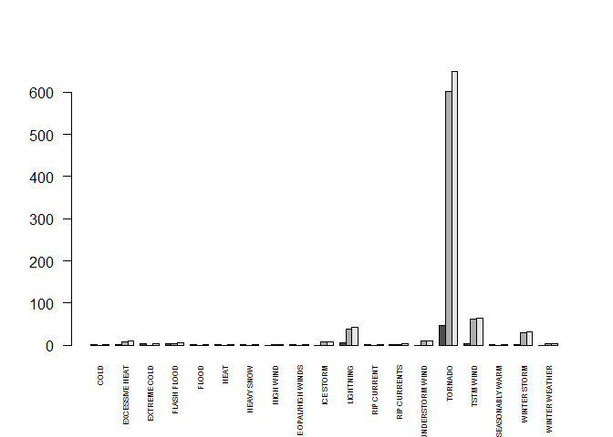

# Damage Analysis of Storms
# Synopsis
Immediately after the title, there should be a synopsis which describes and summarizes your analysis in at most 10 complete sentences.

# Data Processing

```r
library(dplyr)
```

```
## 
## Attaching package: 'dplyr'
## 
## The following objects are masked from 'package:stats':
## 
##     filter, lag
## 
## The following objects are masked from 'package:base':
## 
##     intersect, setdiff, setequal, union
```

```r
library(ggplot2)
setwd ("c:/r_dat/repro_pa2")
#storm <- read.csv(bzfile(paste("repdata_data_StormData.csv.bz2", sep = "")),sep=",")
storm_sample<-tbl_df(read.csv("storm_sample2.csv"))
head(storm_sample)
```

```
## Source: local data frame [6 x 38]
## 
##        X STATE__          BGN_DATE    BGN_TIME TIME_ZONE COUNTY COUNTYNAME
##    (int)   (int)            (fctr)      (fctr)    (fctr)  (int)     (fctr)
## 1 273753      46 6/20/1996 0:00:00 02:00:00 PM       CST    127      UNION
## 2 786503      72  9/5/2009 0:00:00 06:42:00 AM       AST      4     PRZ004
## 3 814171      29 6/14/2010 0:00:00 09:00:00 AM       CST    127     MARION
## 4 300285      40 6/16/1997 0:00:00 09:14:00 PM       CST     19     CARTER
## 5 253373      12 8/19/1996 0:00:00 02:15:00 PM       EST     21    COLLIER
## 6 607877      12  4/8/2006 0:00:00 06:15:00 PM       EST     79    MADISON
## Variables not shown: STATE (fctr), EVTYPE (fctr), BGN_RANGE (dbl), BGN_AZI
##   (fctr), BGN_LOCATI (fctr), END_DATE (fctr), END_TIME (fctr), COUNTY_END
##   (int), COUNTYENDN (lgl), END_RANGE (dbl), END_AZI (fctr), END_LOCATI
##   (fctr), LENGTH (dbl), WIDTH (int), F (int), MAG (int), FATALITIES (int),
##   INJURIES (int), PROPDMG (dbl), PROPDMGEXP (fctr), CROPDMG (dbl),
##   CROPDMGEXP (fctr), WFO (fctr), STATEOFFIC (fctr), ZONENAMES (fctr),
##   LATITUDE (int), LONGITUDE (int), LATITUDE_E (int), LONGITUDE_ (int),
##   REMARKS (fctr), REFNUM (int)
```


There should be a section titled Data Processing which describes (in words and code) how the data were loaded into R and processed for analysis. In particular, your analysis must start from the raw CSV file containing the data. You cannot do any preprocessing outside the document. If preprocessing is time-consuming you may consider using the cache = TRUE option for certain code chunks.

# Publication
For this assignment you will need to publish your analysis on RPubs.com. If you do not already have an account, then you will have to create a new account. After you have completed writing your analysis in RStudio, you can publish it to RPubs by doing the following:  
    * In RStudio, make sure your R Markdown document (.Rmd) document is loaded in the editor  
    * Click the Knit HTML button in the doc toolbar to preview your document.  
    * In the preview window, click the Publish button.  
Once your document is published to RPubs, you should get a unique URL to that document. Make a note of this URL as you will need it to submit your assignment.

# Questions
Your data analysis must address the following questions:  
1. Across the United States, which types of events (as indicated in the EVTYPE variable) are most harmful with respect to population health?  
2. Across the United States, which types of events have the greatest economic consequences?  
Consider writing your report as if it were to be read by a government or municipal manager who might be responsible for preparing for severe weather events and will need to prioritize resources for different types of events. However, there is no need to make any specific recommendations in your report.
## Question 1
First of all we group the storm data by all events, after that we calculate the sum of all fatalities and injuries by each event type. After that, we filter all events in which fatalities OR injuries occured.

```r
by_events<-group_by(storm_sample,EVTYPE)
person_damage<-summarize(by_events,sum_fat=sum(FATALITIES),sum_inj=sum(INJURIES))
person_damage<-filter(person_damage,sum_inj>0 | sum_fat>0)
person_damage$total_persons<-person_damage$sum_inj+person_damage$sum_fat
```


```r
barplot_prep<-t(person_damage[-1])
head(barplot_prep)
```

```
##               [,1] [,2] [,3] [,4] [,5] [,6] [,7] [,8] [,9] [,10] [,11]
## sum_fat          1    2    3    3    1    1    1    0    2     0     6
## sum_inj          0    8    0    3    0    0    0    1    0     8    37
## total_persons    1   10    3    6    1    1    1    1    2     8    43
##               [,12] [,13] [,14] [,15] [,16] [,17] [,18] [,19]
## sum_fat           1     1     0    47     3     1     1     0
## sum_inj           0     2    10   602    61     0    30     3
## total_persons     1     3    10   649    64     1    31     3
```

```r
dim(barplot_prep)
```

```
## [1]  3 19
```

```r
dim(person_damage)
```

```
## [1] 19  4
```

```r
head(person_damage)
```

```
## Source: local data frame [6 x 4]
## 
##           EVTYPE sum_fat sum_inj total_persons
##           (fctr)   (int)   (int)         (int)
## 1           COLD       1       0             1
## 2 EXCESSIVE HEAT       2       8            10
## 3   EXTREME COLD       3       0             3
## 4    FLASH FLOOD       3       3             6
## 5          FLOOD       1       0             1
## 6           HEAT       1       0             1
```

```r
colnames(barplot_prep)<-person_damage$EVTYPE
barplot(barplot_prep,beside=TRUE,cex.names=0.5,las=2)
```

 


```

