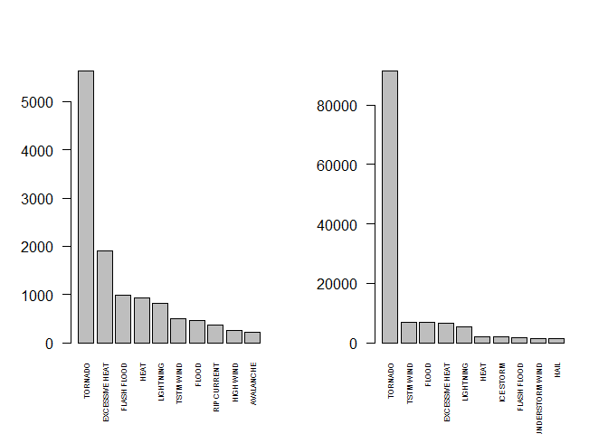
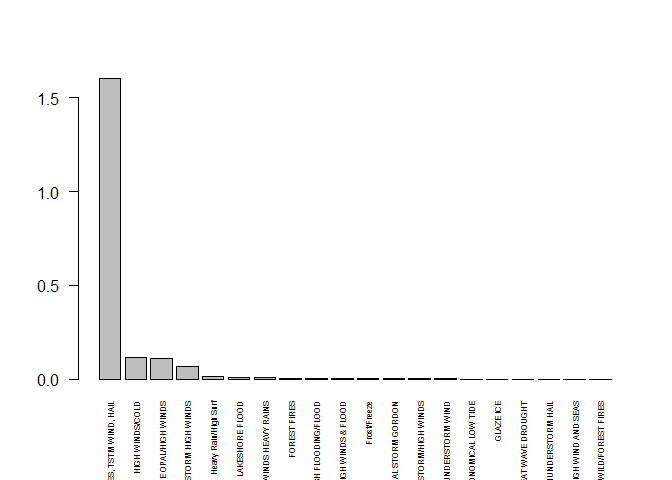

# Damage Analysis of Storms
# Synopsis
This document presents an analysis of weather event types and their negative impacts on economic factors (property and crop damages) and personal health (number of fatalities and number of injuries). It is analyzed which weather events have the largest impacts on each, health and economy.

# Data Processing

```r
library(dplyr)
```

```
## 
## Attaching package: 'dplyr'
## 
## The following objects are masked from 'package:stats':
## 
##     filter, lag
## 
## The following objects are masked from 'package:base':
## 
##     intersect, setdiff, setequal, union
```

```r
setwd ("c:/r_dat/repro_pa2")
storm <- read.csv(bzfile(paste("repdata_data_StormData.csv.bz2", sep = "")),sep=",")
#storm<-tbl_df(read.csv("storm_sample2.csv"))

# The EVTYPE levels are not clean.  The following section is an attempt to clean up
# and categorize all levels to the 47 listed in the Storm Data Documentation in Section 2.1.1
storm$EVTYPE <- gsub("^(HEAT).*", "HEAT", storm$EVTYPE)
storm$EVTYPE <- gsub("^(RECORD HEAT).*", "HEAT", storm$EVTYPE)
storm$EVTYPE <- gsub("^(EXTREME HEAT).*", "HEAT", storm$EVTYPE)
storm$EVTYPE <- gsub("^(Heat).*", "HEAT", storm$EVTYPE)
storm$EVTYPE <- gsub("^(EXCESSIVE HEAT).*", "HEAT", storm$EVTYPE)
storm$EVTYPE <- gsub("^(TSTM).*", "THUNDER STORM", storm$EVTYPE)
storm$EVTYPE <- gsub("^(THUNDERSTORM).*", "THUNDER STORM", storm$EVTYPE)
storm$EVTYPE <- gsub("^(TROPICAL STORM).*", "TROPICAL STORM", storm$EVTYPE)
storm$EVTYPE <- gsub("^(FLASH FLOOD).*", "FLOOD", storm$EVTYPE)
storm$EVTYPE <- gsub("^(WIND).*", "WIND", storm$EVTYPE)
storm$EVTYPE <- gsub("^(STRONG WIND).*", "WIND", storm$EVTYPE)
storm$EVTYPE <- gsub("^(HIGH WIND).*", "WIND", storm$EVTYPE)
storm$EVTYPE <- gsub("^(HURRICANE).*", "HURICCANE", storm$EVTYPE)
storm$EVTYPE <- gsub("^(SNOW).*", "SNOW", storm$EVTYPE)
storm$EVTYPE <- gsub("^(HEAVY SNOW).*", "SNOW", storm$EVTYPE)
storm$EVTYPE <- gsub("^(FIRE).*", "FIRE", storm$EVTYPE)
storm$EVTYPE <- gsub("^(WILD/FOREST FIRE).*", "FIRE", storm$EVTYPE)
storm$EVTYPE <- gsub("^(WILDFIRE).*", "FIRE", storm$EVTYPE)
storm$EVTYPE <- gsub("^(WILD FIRES).*", "FIRE", storm$EVTYPE)
storm$EVTYPE <- gsub("^(HAIL).*", "HAIL", storm$EVTYPE)
storm$EVTYPE <- gsub("^(BLIZZARD).*", "BLIZZARD", storm$EVTYPE)
storm$EVTYPE <- gsub("^(COLD).*", "COLD", storm$EVTYPE)
storm$EVTYPE <- gsub("^(WINTER WEATHER).*", "COLD", storm$EVTYPE)
storm$EVTYPE <- gsub("^(EXTREME COLD).*", "COLD", storm$EVTYPE)
storm$EVTYPE <- gsub("^(RIP).*", "RIP", storm$EVTYPE)
storm$EVTYPE <- gsub("^(FOG).*", "FOG", storm$EVTYPE)
storm$EVTYPE <- gsub("^(DENSE FOG).*", "FOG", storm$EVTYPE)
storm$EVTYPE <- gsub("^(AVALANCHE).*", "AVALANCHE", storm$EVTYPE)
storm$EVTYPE <- gsub("^(AVALANCE).*", "AVALANCHE", storm$EVTYPE)
storm$EVTYPE <- gsub("^(RAIN).*", "RAIN", storm$EVTYPE)
storm$EVTYPE <- gsub("^(HEAVY RAIN).*", "RAIN", storm$EVTYPE)
storm$EVTYPE <- gsub("^(HIGH SURF).*", "SURF", storm$EVTYPE)
storm$EVTYPE <- gsub("^(HEAVY SURF).*", "SURF", storm$EVTYPE)
storm$EVTYPE <- gsub("^(SURF).*", "SURF", storm$EVTYPE)
```
## Data preparation for the results of question 1
We group the storm data by EVTYPE and calculate the sum of all fatalities and injuries by each event type for the grouped stormdata with the summarize function. After that, we filter all events in which fatalities OR injuries occured. Then we sort the data by the sum of fatalities and then by the sum of injuries.

```r
by_events<-group_by(storm,EVTYPE)
person_damage<-summarize(by_events,sum_fat=sum(FATALITIES),sum_inj=sum(INJURIES))
pdamages<-filter(person_damage,sum_inj>0 | sum_fat>0)
pdamages<-arrange(pdamages, desc(sum_fat), desc(sum_inj))
```
## Data preparation for the results of question 2
For the property damage values and the crop damage values, the units of measurements (PROPDMGEXP, CROPDMGEXP) are replaced by numeric values in the storm data set. After that the values in PROPDMG and CROPDMG are multiplied by the numeric values of the units of measurement. We then group the processed data by the weather event variable EVTYPE. After that the amounts of damages for both types (property and crop) are calculated (sum_precondam and sum_crecondam). The data are filtered, sorted in the last step.

```r
storm$PROPDMGEXP <- gsub("\\-|\\+|\\?|0", "1", storm$PROPDMGEXP)
storm$PROPDMGEXP <- gsub("h|H|2","100", storm$PROPDMGEXP)
storm$PROPDMGEXP <- gsub("k|K|3","1000", storm$PROPDMGEXP)
storm$PROPDMGEXP <- gsub("4","10000", storm$PROPDMGEXP)
storm$PROPDMGEXP <- gsub("5","100000", storm$PROPDMGEXP)
storm$PROPDMGEXP <- gsub("m|M|6","1000000", storm$PROPDMGEXP)
storm$PROPDMGEXP <- gsub("7","10000000", storm$PROPDMGEXP)
storm$PROPDMGEXP <- gsub("8","100000000", storm$PROPDMGEXP)
storm$PROPDMGEXP <- gsub("b|B|9","1000000000", storm$PROPDMGEXP)
storm$PROPDMGEXP <- as.numeric(storm$PROPDMGEXP)

storm$CROPDMGEXP <- gsub("\\-|\\+|\\?|0", "1", storm$CROPDMGEXP)
storm$CROPDMGEXP <- gsub("h|H|2","100", storm$CROPDMGEXP)
storm$CROPDMGEXP <- gsub("k|K|3","1000", storm$CROPDMGEXP)
storm$CROPDMGEXP <- gsub("4","10000", storm$CROPDMGEXP)
storm$CROPDMGEXP <- gsub("5","100000", storm$CROPDMGEXP)
storm$CROPDMGEXP <- gsub("m|M|6","1000000", storm$CROPDMGEXP)
storm$CROPDMGEXP <- gsub("7","10000000", storm$CROPDMGEXP)
storm$CROPDMGEXP <- gsub("8","100000000", storm$CROPDMGEXP)
storm$CROPDMGEXP <- gsub("b|B|9","1000000000", storm$CROPDMGEXP)
storm$CROPDMGEXP <- as.numeric(storm$CROPDMGEXP)

storm$PRECONDAM <- storm$PROPDMG * storm$PROPDMGEXP
storm$CRECONDAM <- storm$CROPDMG * storm$CROPDMGEXP
storm$ECONDAM <- storm$PRECONDAM + storm$CRECONDAM

by_events_econ<-group_by(storm,EVTYPE)
econ_damage<-summarize(by_events_econ, sum_econdam=sum(ECONDAM))
edamages<-filter(econ_damage,sum_econdam>0)
edamages<-arrange(edamages, desc(sum_econdam))
```

# Results
## Results Q1

```r
pdamages<-head(pdamages,10)
print(pdamages)
```

```
## Source: local data frame [10 x 3]
## 
##           EVTYPE sum_fat sum_inj
##            (chr)   (dbl)   (dbl)
## 1        TORNADO    5633   91346
## 2           HEAT    3119    9224
## 3          FLOOD    1488    8574
## 4      LIGHTNING     816    5230
## 5  THUNDER STORM     710    9508
## 6            RIP     577     529
## 7           COLD     499     853
## 8           WIND     428    1859
## 9      AVALANCHE     225     170
## 10  WINTER STORM     206    1321
```

```r
par(mfrow=c(1,2))
barplot(pdamages$sum_fat,names.arg=pdamages$EVTYPE,cex.names=0.5,las=2)
barplot(pdamages$sum_inj,names.arg=pdamages$EVTYPE,cex.names=0.5,las=2)
```

 
  
## Results Q2

```r
edamages<-head(edamages,10)
print(edamages)
```

```
## Source: local data frame [10 x 2]
## 
##                        EVTYPE sum_econdam
##                         (chr)       (dbl)
## 1  TORNADOES, TSTM WIND, HAIL  1602500000
## 2     WINTER STORM HIGH WINDS    65000000
## 3        Heavy Rain/High Surf    15000000
## 4             LAKESHORE FLOOD     7540000
## 5                FOREST FIRES     5500000
## 6                Frost/Freeze     1100000
## 7       DUST STORM/HIGH WINDS      550000
## 8    MARINE THUNDERSTORM WIND      486400
## 9       ASTRONOMICAL LOW TIDE      320000
## 10                  GLAZE ICE      305300
```

```r
barplot(edamages$sum_econdam, names.arg=edamages$EVTYPE,cex.names=0.5,las=2)
```

 
